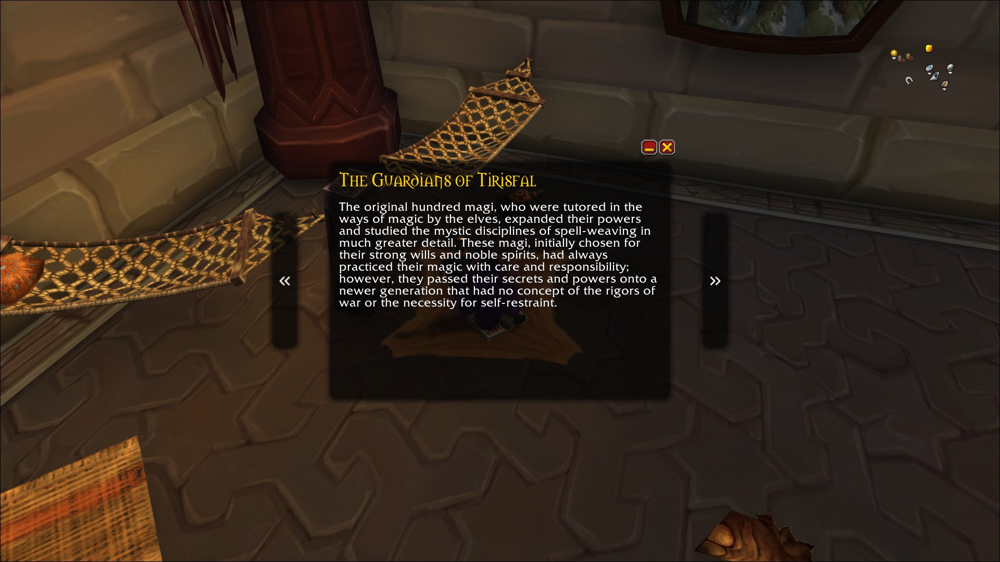

# Booky

## Overview
**Booky** is an addon for World of Warcraft, that creates an immersive reading experience for all books, scrolls and other lore items, that would be otherwise displayed on the lefthand side in a small panel.

(Minimize button shows the UI. This button will be removed in coming versions.)

## Screenshot

## TODO
- user preferences
- cleanup of unused files

## Ackowledgments
- textures and a snippet of code for the frames were taken from @seblindfors [Immersion](https://github.com/seblindfors/Immersion) addon
- [Feather](https://github.com/feathericons/feather) icons for the arrows icons
- [Ace3](https://www.wowace.com/projects/ace3) libraries